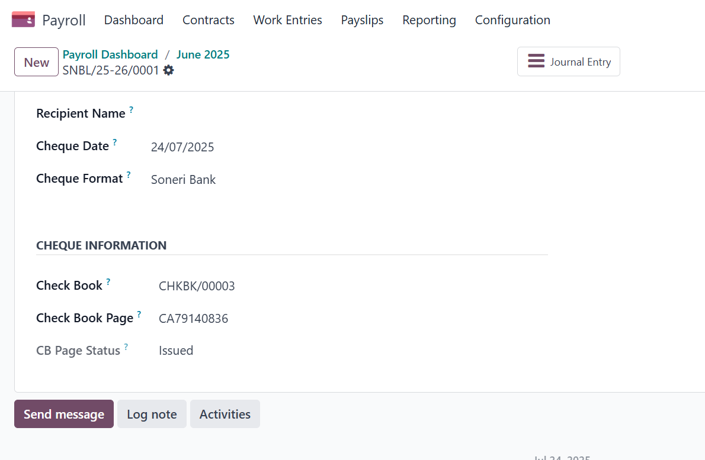
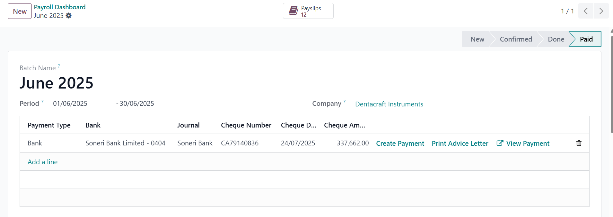
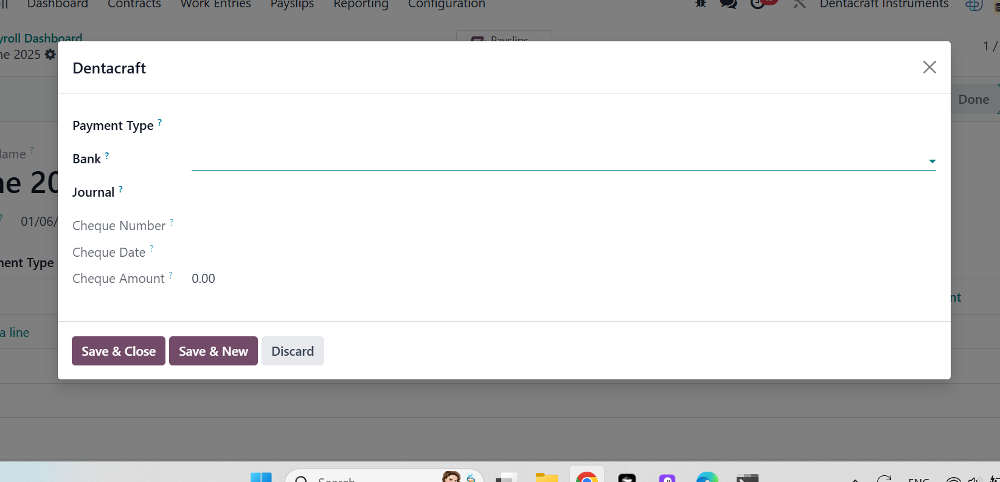

===========================
Bank Advice Letter for Payroll
===========================

This module by **PearlSol** enables the generation of bank advice letters during the payroll process in Odoo. It streamlines salary payments via bank and ensures proper reporting for employee payments.

Key Features
============
- Create Payroll Batches (monthly or custom)
- Generate Payslips and Journal Entries
- Select Payment Method: Bank or Cash
- Generate Payment Entries
- Print Bank Advice Letters grouped by Journal
- Configure payable accounts per journal
- Track Cheque Numbers and Bank Info

How It Works
============
1. Go to **Payroll > Batches**
2. Create a new batch and assign a month
3. Add employees and generate payslips
4. Create draft accounting entries
5. In the grid, select payment method (Bank/Cash)
6. Create payments and print advice letters

Installation
============
Install the module like a regular Odoo module. Make sure:
- Journals are configured with a **Payable Account**
- Employees have bank account details set

Screenshots
===========

Support & Licensing
===================
This module is **commercial** and licensed under the **OPL-1**.

For license purchase or support:
- 🌐 https://pearlsol.com
- 📧 info@pearlsol.com
